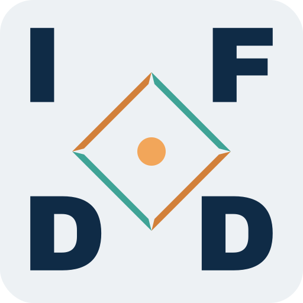

# IFDD — Integration of Federated Data Domains



Most integration projects start by building a place where all the data is supposed
to end up. IFDD starts from the opposite assumption: **the data stays where it is
produced, and integration happens through shared meaning instead of shared storage.**

`ifdd/overview` is the front door to that idea. It holds the concepts, the naming
rules and the brand assets behind `ifdd.de`. Code lives in
sibling repositories of the [`ifdd`](https://github.com/ifdd) organisation; the
reasoning lives here.

```bash
git clone https://github.com/ifdd/overview.git
```

---

## The idea in three sentences

- **Domains keep their data.** Every domain — a team, a system, a person — publishes
  its own records from its own endpoint and stays responsible for them.
- **A shared schema replaces a shared system.** Records are validated against a
  published LinkML schema and served as JSON-LD, so a YAML file, a Django service and
  an ERP system can take part in the same federation.
- **Identity is separate from location.** Identifiers are permanent addresses; hosts
  are operational addresses that may change. That separation is what makes the whole
  federation survive reorganisation.

## Names as architecture

The DNS tree is not decoration — it carries the model. Delegating a subdomain is how
a domain becomes autonomous, and the three address spaces make the difference between
identity, meaning and location explicit.

| Address space | Example | Property |
| --- | --- | --- |
| Vocabulary | `https://schema.tools.ifdd.de/tools` | versioned, public |
| Identity | `https://id.ifdd.de/tools/<uuid>` | permanent, location-independent |
| Location | `https://p2.tools.ifdd.de/inventory.jsonld` | operational, replaceable |

A node publishes its own location as an attribute of itself. Nothing else needs to
know where it lives.

→ [Naming and namespace concept](docs/concepts/02-namespace.md)

## Repository map

| Path | Contents |
| --- | --- |
| `docs/concepts/` | The ideas: naming, namespace |
| `docs/decisions/` | Architecture decision records, newest last |
| `brand/` | Logo generator and generated assets |
| `README_logos.md` | How to regenerate the brand assets |
| `HISTORY_ifdd.md` | Where this comes from, and what was learned |

New descriptive material about `ifdd.de` belongs in `ifdd/overview`. Implementations
get their own repository in the same organisation and link back to the concept they
implement.

## Where this comes from

- **d3 — "distributed data driven"**: JSON-LD contexts shipped as their own service,
  temporal validity and provenance as first-class terms, collectors that read from the
  systems that own the data.
- **Its limit:** the contexts were handwritten against localhost addresses, and the
  assembled graph lived in one service. Distributed inputs, central responsibility.
- **d4** — a cookiecutter template for services that collect from several single points
  of truth and publish JSON-LD over REST. The template survives; the framing changed
  from "service scaffold" to "federation member".
- **IFDD** — the step from tooling to a named architecture: a validated schema instead
  of a handwritten context, permanent identifiers instead of development URLs, and
  responsibility that stays with the domain.

→ [Full history](HISTORY_ifdd.md)

## Status

Early and open. The concepts are written, and the implementation repositories are being
set up. Expect the naming rules to stay stable and everything else to move.

## Contributing

Issues and pull requests are welcome, especially:

- counter-examples where the federated approach breaks down,
- adapters for source systems that are not yet covered,
- corrections — technical claims in this repository are meant to be falsifiable.

## License

BSD-3-Clause. See [LICENSE](LICENSE).

## Brand

Wordmark, favicon and the generator that produces them are in `brand/`. The mark uses
[Archivo Black](https://fonts.google.com/specimen/Archivo+Black) under the SIL Open
Font License; the font file is not part of this license.
